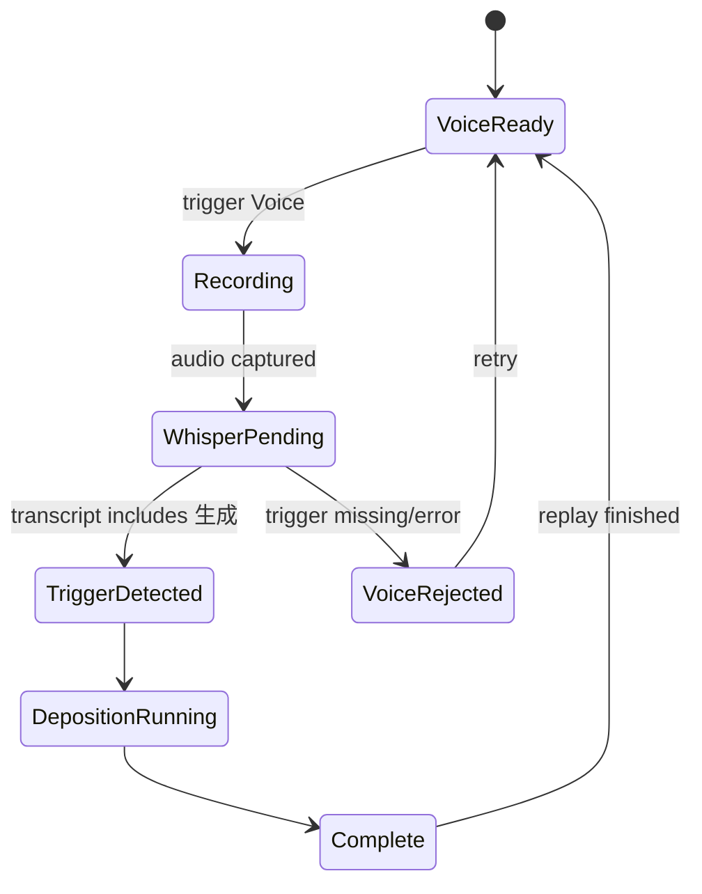
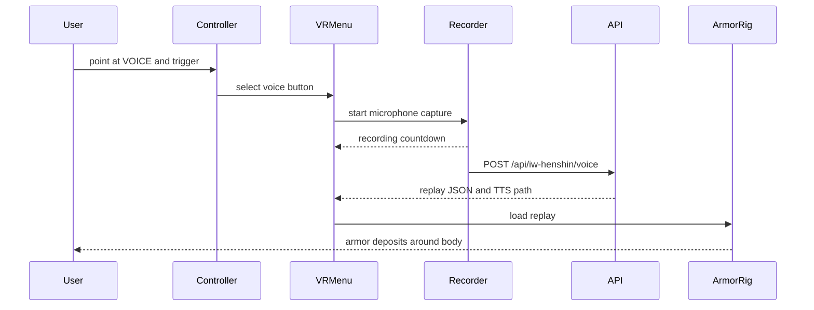

# Quest VR Henshin Experience Design

Updated: 2026-04-18

## Goal

Quest 3 の体験を「正面にある変身デモを見る」から「自分を中心に装甲がまとわれる VR 体験」へ移す。

まずは `viewer/quest-iw-demo` の既存 IWSDK 実装を壊さず、以下を設計単位として段階実装する。

- VR 内で見える操作メニュー
- 音声待機、録音中、Whisper 処理中、蒸着中の状態表示
- 自分の身体軸を中心にした装甲生成アニメーション
- BGM と TTS の音声レイヤー
- Quest 実機での検証手順

## Current Problem

現状の DOM HUD は PC/2D 画面では分かりやすいが、VR セッション中は視界内の操作導線として弱い。

- `Voice` ボタンが VR 内で見えない
- 録音待機中か、録音中か、Whisper 待ちかが分かりづらい
- アーマーがユーザーの前方に表示されるため「自分に纏う」感覚が薄い
- TTS はあるが、BGM と効果音の舞台装置がまだない

## Implementation Status

- 2026-04-18: `Slice 1` implemented in `viewer/quest-iw-demo/quest-demo.js` as `SpatialControlPanel`.
- 2026-04-18: `Slice 2` implemented as a headset-following user anchor for immersive VR.
- 2026-04-18: Initial `Slice 3` audio bed added as an optional Web Audio BGM foundation. BGM is off by default; use `?bgm=1` only when checking it intentionally.
- 2026-04-18: Page startup no longer auto-plays the default deposition replay. Voice-triggered deposition starts only after Sakura Whisper confirms `生成`, unless `?mockTrigger=1` is explicitly used for developer smoke tests.

## Experience Architecture

```mermaid
flowchart LR
  "Quest Browser" --> "IWSDK World"
  "IWSDK World" --> "XR Session immersive-vr"
  "XR Session immersive-vr" --> "Spatial Menu"
  "XR Session immersive-vr" --> "User-Centered Armor Rig"
  "Spatial Menu" --> "Voice Capture"
  "Voice Capture" --> "Local API Proxy"
  "Local API Proxy" --> "Sakura Whisper / mock trigger"
  "Sakura Whisper / mock trigger" --> "Henshin Replay JSON"
  "Henshin Replay JSON" --> "User-Centered Armor Rig"
  "Henshin Replay JSON" --> "TTS"
  "BGM Layer" --> "XR Session immersive-vr"
  "TTS" --> "XR Session immersive-vr"
```

The Vite/IWSDK page stays the browser entrypoint. The Python API remains behind the Vite proxy so Quest only needs one origin.

## Spatial Layout

The VR scene should have two anchors:

1. User anchor: follows the headset position/yaw and is used for armor deposition.
2. Menu anchor: floats in front of the headset when idle or when the user looks down slightly.

```mermaid
flowchart TB
  "Headset Camera" --> "User Anchor"
  "Headset Camera" --> "Menu Anchor"
  "User Anchor" --> "Helmet halo"
  "User Anchor" --> "Chest / back plates"
  "User Anchor" --> "Arm plates"
  "User Anchor" --> "Leg plates"
  "Menu Anchor" --> "Voice button"
  "Menu Anchor" --> "Replay button"
  "Menu Anchor" --> "Pause button"
  "Menu Anchor" --> "Status indicator"
```

### User Anchor

In immersive VR, the armor rig should no longer remain at `z=-2.55` as a remote mannequin.

Instead:

- `anchor.xyz` follows the headset world position.
- `anchor.rotation.y` follows headset yaw, so left/right armor remains body-relative.
- Armor starts slightly outside the body radius, then contracts inward.
- Until live mocopi is connected, part placement uses a conservative headset-relative body approximation rather than claiming full body tracking.

This gives the effect of the armor arriving around the player, without putting geometry directly inside the camera.

### Menu Anchor

The menu is not a DOM overlay. It is a 3D panel in the IWSDK/Three scene.

- Position: about `0.55m` below eye level and `1.2m` forward.
- Width: about `0.75m`.
- Buttons: `VOICE`, `REPLAY`, `PAUSE`.
- Controller trigger uses raycast selection.
- In non-VR, the existing DOM buttons remain available.

## Voice State Model



Visual state requirements:

- `VoiceReady`: blue pulse, text `VOICE READY`, short hint `Trigger: 生成`.
- `Recording`: amber/red pulse, countdown ring, text `LISTENING`.
- `WhisperPending`: rotating scan line, text `ANALYZING`.
- `TriggerDetected`: gold flash, text `生成 DETECTED`.
- `DepositionRunning`: body-centered rings, mesh material emission, progress strip.
- `Complete`: white/gold seal flash, text `ARMOR ONLINE`.
- `VoiceRejected`: red short flash, text `RETRY VOICE`.

## Interaction Design



Controller mapping:

- Primary trigger on menu target: activate selected button.
- Primary trigger with no menu hit while `VoiceReady`: start voice.
- `A` / right primary button, if exposed by the browser gamepad: start voice as a shortcut.
- Existing DOM buttons remain for PC debugging.

## User-Centered Deposition Animation

The animation should not read as an avatar preview. It should read as a suit forming around the user.

Proposed phases:

1. **Calibration pulse**: a thin ring expands from the floor around the user.
2. **Scan pillar**: vertical lines rise from foot to head.
3. **Part staging**: armor parts appear as ghost silhouettes at a radius around the body.
4. **Contraction**: parts move inward to body-relative offsets.
5. **Seal**: chest core, forearms, shins, helmet halo flash in sequence.
6. **Active idle**: low-emission armor outline remains around the user; menu returns to `VOICE READY`.

Implementation mapping:

- Existing `body-sim.json` remains the canonical replay source.
- `applySegmentPose()` can remain, but its result should be interpreted as local body offsets under the user anchor.
- Add a pre-fit offset per part so meshes do not intersect the camera.
- Add a `stagedPosition` per part during `progress < 0.55`, then interpolate to fitted pose.

## Audio Design

BGM should be optional, off by default, and unlocked only after a user gesture, because browsers block autoplay.

Audio layers:

- BGM: low-volume asset loop after `Enter VR` or first controller trigger, only when `?bgm=1&bgmSrc=/path/to/loop.mp3` is set.
- Voice/TTS: generated explanation, ducking BGM volume while speaking.
- UI tones: short local oscillator or small audio assets for `voice ready`, `detected`, `complete`.

Default volumes:

- BGM: `0.08`
- TTS: `1.0`
- UI tones: `0.35`

Quest validation needs to check that BGM does not hide the TTS explanation. If the sound bed feels tiring, keep `?bgm=1` out of the default demo URL.

## Implementation Slices

### Slice 1: VR Menu And Voice State

Add a `SpatialControlPanel` class inside `quest-demo.js`.

Responsibilities:

- Build 3D panel/button meshes.
- Render button text with `CanvasTexture`.
- Track `voiceState`.
- Raycast Quest controllers against button meshes.
- Call existing `runVoiceCommand()`, `replayFromStart()`, and pause toggle.

Validation:

- Desktop browser still shows DOM controls.
- In VR, panel is visible without looking for the DOM overlay.
- Controller trigger starts recording.
- State label changes during dry-run voice flow.

### Slice 2: User-Centered Armor Rig

Add a body anchor mode when `world.session` exists.

Responsibilities:

- Follow headset world `x/z`.
- Derive torso anchor from headset height.
- Follow headset yaw.
- Keep armor geometry outside the camera near plane.
- Keep non-VR preview behavior for desktop.

Validation:

- In VR, rings originate around the user.
- Looking down shows chest/arm/leg deposition around the body.
- No helmet or chest plate clips into the camera.
- Non-VR preview still works.

### Slice 3: Audio Bed

Add an optional `AudioBed` class.

Responsibilities:

- Start BGM only after user gesture and only when `?bgm=1&bgmSrc=...` is present.
- Loop the supplied BGM asset at low volume.
- Duck during TTS.
- Provide simple synthesized status tones if no assets exist.

Validation:

- No autoplay error before gesture.
- BGM is silent by default.
- With `?bgm=1&bgmSrc=...`, BGM starts after `Enter VR` or first `Voice`.
- TTS remains intelligible.

## Quest Test Matrix

| Case | Expected result |
| --- | --- |
| Open page in Quest Browser | Page loads, `Enter VR` visible |
| Enter VR | 3D menu appears in headset |
| Select `VOICE` in VR | Recording state appears in 3D menu |
| Say `生成` with Sakura Whisper enabled | Trigger detected and deposition starts |
| Use `?mockTrigger=1` | Developer smoke test starts deposition without Sakura calls |
| During deposition | Rings and armor are centered around user |
| Replay | Same body-centered deposition plays again |
| Pause | Animation and progress pause |
| Exit VR | DOM controls still work |
| Re-enter VR | Menu and body anchor recover |

## Acceptance Criteria For Next Build

- Quest user can start voice capture without using the 2D DOM HUD.
- Voice waiting and recording status are legible inside VR.
- Deposition animation is centered on the user's body axis in immersive VR.
- DOM debug controls still work outside VR.
- BGM is gated behind a user action and enabled only by query param.
- No regressions in `node --check`, Vite build, or Python tests.
